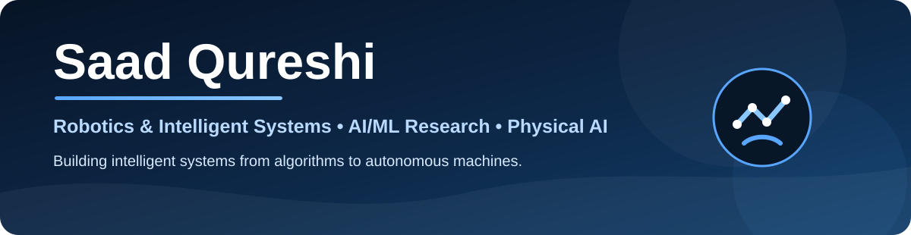
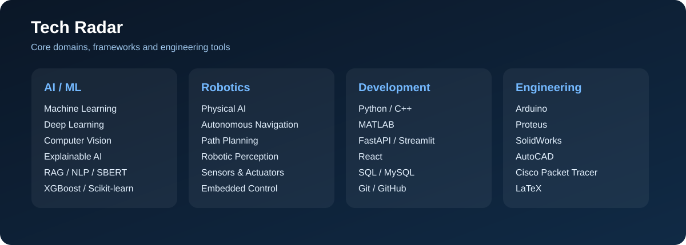

 

### Robotics & Intelligent Systems · Artificial Intelligence · Machine Learning · Physical AI

**Student Researcher building intelligent systems across AI, robotics and real-world applications.**

 

 

---

## About Me

I'm **Saad Qureshi**, a **BS Robotics & Intelligent Systems student and Student Researcher at Bahria University**.

My work focuses on the intersection of **Artificial Intelligence, Machine Learning, Robotics and Embedded Systems**, with particular interest in building systems that can **perceive, reason, make decisions and interact with the real world**.

My current technical interests include:

- Artificial Intelligence & Machine Learning
- Deep Learning & Computer Vision
- Retrieval-Augmented Generation
- Explainable AI
- Autonomous Navigation
- Physical AI
- Embedded & Edge Intelligence
- Predictive Modeling

---

## Research Focus

<table>
<tr>
<td width="50%" valign="top">

### Artificial Intelligence

- Machine Learning
- Deep Learning
- Explainable AI
- Generative AI
- Natural Language Processing
- Retrieval-Augmented Generation
- Semantic Search
- Predictive Modeling

</td>

<td width="50%" valign="top">

### Robotics & Intelligent Systems

- Physical AI
- Autonomous Navigation
- Robotic Perception
- Computer Vision
- Embedded Systems
- Sensors & Actuators
- Edge AI
- Intelligent Control

</td>
</tr>
</table>

---

# Featured Work

## Autonomous Robot Navigation System

Developed a Python-based autonomous mobile robot navigation system featuring **vision-based environment perception, dynamic obstacle detection and adaptive path re-planning**.

Implemented **D\* Lite** for dynamic environments and benchmarked its performance against **A\*** and **Dijkstra** using path cost, planning time and search efficiency.

`Python` `Computer Vision` `D* Lite` `A*` `Dijkstra` `Path Planning`

---

## CRIS — Corruption Risk Intelligence System

Research-oriented machine learning system for identifying and analyzing corruption risk in financial governance.

The system evaluates **SVM, Random Forest, XGBoost and Stacking Ensembles**, supported by **Explainable AI** for model interpretation.

`Python` `Scikit-learn` `XGBoost` `Ensemble Learning` `XAI` `Streamlit`

---

## Adaptive Technical Interview System

Closed-loop intelligent interview framework combining **Retrieval-Augmented Generation** with **Sentence-BERT semantic scoring**.

The system performs semantic answer evaluation and dynamically adapts interview difficulty according to candidate performance.

`RAG` `Sentence-BERT` `FAISS` `NLP` `Semantic Similarity` `Python`

---

## Explainable ML for Inflation Forecasting in Türkiye

Research investigating the predictive role of **Turkish Lira depreciation and macroeconomic indicators** in inflation forecasting.

The study considers variables including **TRY/USD exchange rate, CPI, energy prices, imports and exports**.

`Machine Learning` `Time Series` `XGBoost` `Explainable AI` `Economic Forecasting`

---

## BankGuard AI

Machine learning system for counterfeit banknote detection using multiple classification algorithms including **SVM, KNN, Random Forest and Logistic Regression**.

`Python` `Machine Learning` `Classification` `Scikit-learn`

---

## DocuMind — RAG Document Intelligence

Full-stack document question-answering system based on **Retrieval-Augmented Generation and semantic vector search**.

Built using React, FastAPI, FAISS, Gemini embeddings and SQLAlchemy.

`React` `FastAPI` `FAISS` `RAG` `Gemini` `SQLAlchemy`

---

## 4-DOF Color Sorting Robotic Arm

Designed a robotic arm capable of detecting and sorting objects by color using servo-based manipulation and embedded control.

**Achievement:** First Prize

`Arduino` `Servo Motors` `Color Sensor` `Embedded Systems` `PCB`

---

## Multi-Campus University Communication Network

Designed a secure multi-campus network architecture using **OSPF Area 0, VLAN segmentation and ACL-based access control**.

**Achievement:** First Prize

`Cisco` `OSPF` `VLANs` `ACLs` `Routing` `Network Security`

---

# Research

### CRIS: A Multi-Algorithm Corruption Risk Intelligence System for Financial Governance Using Machine Learning

**Status:** Under Review  
**Areas:** Machine Learning · Ensemble Learning · Explainable AI

---

### A Closed-Loop Adaptive Technical Interview System Using Retrieval-Augmented Generation and Sentence-BERT Semantic Scoring

**Status:** Under Review  
**Areas:** RAG · NLP · Semantic Evaluation · Adaptive AI

---

### Explainable Machine Learning for Inflation Forecasting in Türkiye: Assessing the Predictive Role of Turkish Lira Depreciation

**Areas:** Machine Learning · Explainable AI · Economic Forecasting

---

# Technical Stack

### Programming

`MATLAB` · `SQL` · `Arduino C/C++`

### AI & Machine Learning

`Scikit-learn` · `XGBoost` · `FAISS` · `RAG` · `NLP` · `XAI`

### Development

`Streamlit` · `SQLAlchemy` · `REST APIs`

### Robotics & Engineering

`Embedded Systems` · `Sensors & Actuators` · `Autonomous Navigation` · `Physical AI` · `Control Systems`

### Engineering Tools

`MATLAB / Simulink` · `Proteus` · `SolidWorks` · `AutoCAD` · `Cisco Packet Tracer` · `LaTeX`

---

# Technology Radar

---

# GitHub Analytics

 

---

# Contribution Activity

---

# Contribution Snake

<picture>
  <source
    media="(prefers-color-scheme: dark)"
    srcset="https://raw.githubusercontent.com/SaadQureshi002/SaadQureshi002/output/github-snake-dark.svg">
  <source
    media="(prefers-color-scheme: light)"
    srcset="https://raw.githubusercontent.com/SaadQureshi002/SaadQureshi002/output/github-snake.svg">
  
</picture>

---

# Weekly Development Activity

<!--START_SECTION:waka-->
<!--END_SECTION:waka-->

---

# Selected Certifications

- **Machine Learning Specialization** — DeepLearning.AI
- **Deep Learning Specialization** — DeepLearning.AI
- **Generative AI with Large Language Models** — DeepLearning.AI & AWS
- **Building Systems with the ChatGPT API** — DeepLearning.AI
- **Prompt Engineering for ChatGPT** — Vanderbilt University
- **AI Fluency: Framework & Foundations** — Anthropic Academy
- **Agentic AI Foundations Associate** — Oracle
- **Global MOOC on the Ethics of AI** — UNESCO
- **Fundamentals of Machine Learning & Artificial Intelligence** — AWS

---

# Current Direction

### Artificial Intelligence → Robotics → Edge Intelligence → Physical AI

 

`PERCEIVE → UNDERSTAND → REASON → PLAN → ACT → ADAPT`

My current focus is on developing intelligent systems that move beyond software-only environments and combine **AI-driven reasoning with autonomous interaction in the physical world**.

---

# Connect

Interested in **AI, Robotics, Machine Learning or Research collaboration?**

 

  

